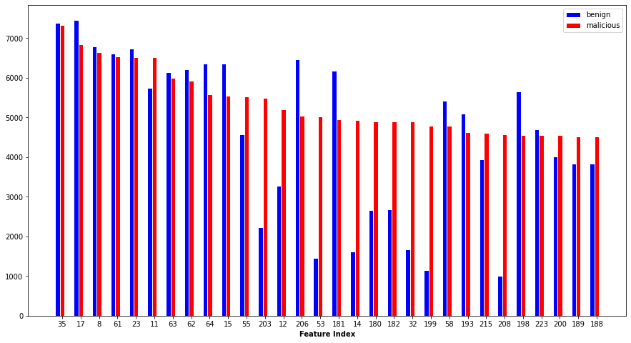
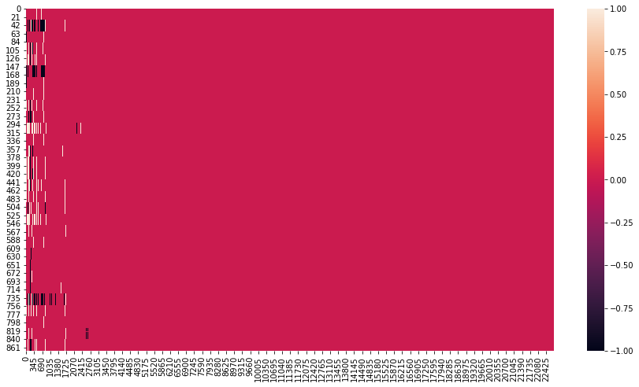

# Lab 4

## Team
1. Sharwin Bobde (5011639)
2. Nikhil Saldanha (4998707)

## 1. Familiarization Task

### 1.1. Compare malicious, benign and adversarial samples before training

**Setup for `framework.py`:**
- In the training loop inside `def main`, we convert `bon_x` and `mal_x` into numpy arrays using `tensor.cpu().numpy()` and collect these into a numpy array.
- We do the same for adversarial samples `mal_x` after returning from `inner_maximizer()`.
-After the train loop, we use `np.save()` to save these to disk.

**Setup for `parameters.ini`:**
- point `benign_filepath` to `data/defend/benign/`and `malicious_filepath` to `data/defend/malicious/`
- set `training_method` to `dfgsm_k`
- set `ff_num_epochs` to 1
- `eval = False`, `attack = False` and `defend = True`

After running the model for about 1000 steps of an epoch, we analyse the saved samples:

#### 1.1.1. Malicious vs. Benign

First, we want to see a distribution of API calls over the samples. For this, we count the 1s for each feature index for both malicious and benign and display the frequencies of top 30 features indices with highest counts in malicious samples. This is shown below:

We can see that though there is similarity in counts initially for some features, many features have dissimilarity in counts. These are probably the API calls which are important in differentiating benign and malicious.

Next, we would like to visualize which API calls that are present in benign are not present in malicious and vice versa. To do this, we sample again the features with most counts in malicious. We then permute these to create random pairs between benign and malicious. We subtract each of these pairs and visualize the results in a heat map shown below:

We can see each row as the difference between a random pair of benign and malicious samples. Each column is the feature differences. Red depicts that the feature stayed same (1 -> 1 or 0 -> 0), black means 0 -> 1 and white 1 -> 0. Hence, this visual shows that for a majority of the samples, they differ in first ~2600 features (black and white) and rest remain same (red). Hence, the first 2000 odd features are most important to distinguish between malicious and benign

#### 1.1.2 Adversarial

Lets order the data by the decreasing frequency of malicious data, because this makes the data charactristically malicious.

We see in the above frequency histogram of the adversarial data (blue) increases the 1s where the frequency for the benign data is higher. This means it ties to adapt to the form of the benign data to remain.

### 1.2 Compare malicious and adversarial samples after defense training

**Setup for `framework.py`:**

- Remove the code added in the previous part for printing to file

**Setup for `parameters.ini`:**

- Set `save_every_epoch = True`

Train for 50 epochs. Set `model_weights_path` to the saved model after 50 epochs. Then add back the code from previous part to save the samples again.

## 2. Inner Maximizer Task